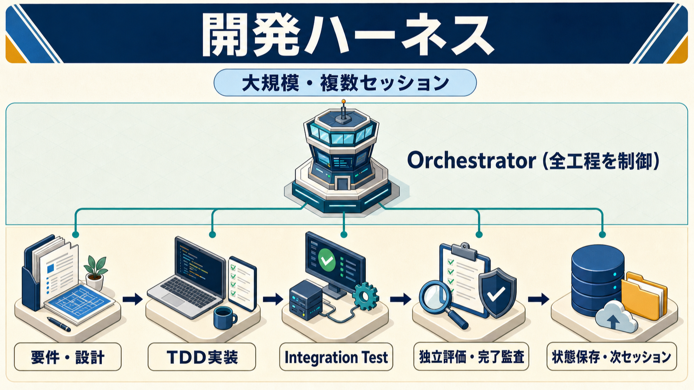

# Claude Code Development Harness

## 概要

要件定義から実装完了までを、工程、専門エージェント、成果物ハンドオフ、決定論的品質ゲート、永続化された状態で制御する開発ハーネスパターンです。UT駆動TDDとIntegration Testを中心に、長時間・複数セッションでも再開可能な開発プロセスを構成します。

## 向いているケース

1. 新規開発を要件定義、設計、TDD実装、Integration Test、完了監査まで品質ゲート付きで進める。
2. 既存リポジトリを調査し、実測したbuild、test、static analysisをbaseline化してから開発する。
3. 長時間・複数セッションの作業をprogress、handoff、context manifestから再開する。
4. Planner、Generator、Evaluatorを分離し、成果物作成と独立レビューを別Agentで行う。
5. 複数Agentやworktreeで、single-writer状態管理と権限境界により競合や越権を抑える。
6. Hooksを利用できない環境で、External Harness RunnerによるCompatibleモードを使用する。

## 対象外

- Contract Test
- 本番リリース、デプロイ、運用監視（進行中の障害対応は[Incident Response Harness](../claude-code-incident-response-harness/README.md)を使う）
- 小さな単発修正へのフル構成の適用
- 特定技術スタックへの完全な最適化

## 主要コンポーネント

- Development Orchestrator、Initializer、Continuation
- Planner、Generator、Independent Evaluator、Completion Auditor
- Responsible Human Reviewer、Human Review Evidence
- Context Builder、context manifest、progress、handoff
- Deterministic Guardrail、permissions、sandbox、External Harness Runner
- Progressive Disclosure Skills、Harness Evals

Human Review Evidenceは認証済みreview provider、protected branch approvalまたはsigned attestationからread-onlyで取得し、Git内の自己申告を承認根拠にしない。

## 設計書

- [Claude Code 開発ハーネス設計書](docs/design.md)
- [Initializer Agent雛形](templates/agents/initializer.md)
- [Development Orchestrator Agent雛形](templates/agents/development-orchestrator.md)
- [Harness Reviewer Agent雛形](templates/agents/harness-reviewer.md)
- [Continuation Agent雛形](templates/agents/continuation.md)
- [Context Builder Agent雛形](templates/agents/context-builder.md)
- [Requirements Planner Agent雛形](templates/agents/requirements-planner.md)
- [Requirements Analyst Agent雛形](templates/agents/requirements-analyst.md)
- [Requirements Reviewer Agent雛形](templates/agents/requirements-reviewer.md)
- [Architecture Planner Agent雛形](templates/agents/architecture-planner.md)
- [Architect Agent雛形](templates/agents/architect.md)
- [Detailed Designer Agent雛形](templates/agents/detailed-designer.md)
- [Design Reviewer Agent雛形](templates/agents/design-reviewer.md)

## 最小導入手順

1. main/master以外のfeatureブランチを用意する。
2. 既存の検証script、Hook、Runnerと推移的な呼出先をread-onlyで監査する。
3. permissions、sandbox、Network既定deny、権限境界を設定する。
4. 設計書のPhase 0に従って変更前baselineを採取する。
5. `CLAUDE.md`、`progress.yaml`、最初のhandoff、context manifestを用意する。
6. 現在工程に必要なAgentとSkillだけを用意し、品質ゲートをRunnerまたはHooksで強制する。
7. 小さなタスクで一巡させ、Harness Evalsで再開性とゲート動作を確認する。

機能固有の要件・設計・テスト・レビュー・handoffは、原則`docs/features/<feature-id>/`へまとめます。共有規約と横断ADRだけを機能外へ置きます。ハーネス選択は[共通適用ガイド](../README.md)を参照してください。

非自明なAI支援変更は[Change Intent Record](../change-intent-record.md)に従い、目的、理由、制約、対象外、要件・コード・テスト・ADRへの参照を既存成果物へ短く記録します。完全な会話履歴は設計文書の代用にしません。

非自明な設計意図の正本はGit/version control内の既存成果物へ置き、PR、issue、外部文書は固定revision、commit SHAまたはimmutable snapshot付きのsource/mirrorとしてのみ参照する。
