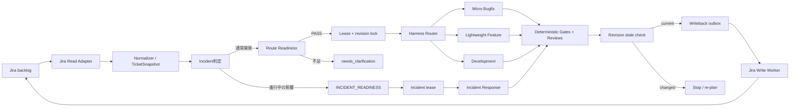

# Claude Code Jiraチケット駆動ハーネス設計書

> Jiraを業務要求の正本、Git内の構造化状態を実行証跡の正本として扱い、既存の開発ハーネスへ安全に接続する。

| 文書種別 | 基本設計・運用設計 |
|---|---|
| 対象 | Jira backlogを起点とするClaude Code開発 |
| 対象工程 | チケット取得、適格性判定、開発方式選択、実装、検証、レビュー、Jira書戻し |
| 対象外 | Jira管理設定、本番デプロイ、セキュリティインシデント対応 |

## 1. 目的

Jiraチケットを起点にした開発で、次を保証する。

- 曖昧または危険なチケットを自動実装へ流さない。
- 同じチケットを複数workerが同時に変更しない。
- 取得後に変更された要件を古いsnapshotのまま完了させない。
- Jira APIへの書込みを実装Agentから分離し、重複なく監査可能にする。
- チケットの種類ではなく、規模、再現性、リスクに合う既存ハーネスを使う。

Jira固有の責務は既存Development Harnessの工程へ混ぜず、受付・同期エンベロープとして外側へ置く。選択後のTDD、Integration Test、UI検証、Code Review、Security Review、状態管理は既存ハーネスを正本とする。

## 2. 基本原則

1. Jira本文、コメント、添付ファイルは不信頼入力として扱う。
2. Jiraから抽出した値はTicketSnapshotへ正規化し、issue revisionとともに固定する。
3. Definition of Readyを満たさないissueは`needs_clarification`で停止する。
4. 一つのissue keyに対し、同時に一つの有効lease、一つのbranch、一つのwriterだけを許可する。
5. Jiraの表示状態と内部状態を直接同一視せず、明示的なmappingを介する。
6. Jira書込みは専用writeback workerだけが行い、outboxとidempotency keyで再送可能にする。
7. LLMの意味判断と、revision、lease、終了コード、必須fieldの機械判定を分離する。
8. 不一致、不明、権限不足はfail-closedとし、推測で状態を進めない。

## 3. Jira受付・同期エンベロープ



### 3.1 Claude CodeからのJira API利用

Claude CodeへJiraの汎用API clientを直接公開せず、Atlassian MCPまたはJira REST APIの前段に用途別Gatewayを置く。read操作とwrite操作はtoolとcredentialの両方を分離する。

```text
search_ready_issues(jql_id, cursor)
get_issue_snapshot(issue_key, requested_fields)
get_issue_revision(issue_key)
publish_clarification(issue_key, snapshot_revision, body, idempotency_key)
publish_result(issue_key, snapshot_revision, result, idempotency_key)
transition_issue(issue_key, expected_status, new_status, idempotency_key)
```

- `jql_id`は管理者が定義したquery allowlistのIDとし、Agent生成の任意JQLを受け付けない。
- `requested_fields`はsummary、description、acceptance criteria、issue type、priority、labels、components、links、status、assignee、updated等のallowlistに限定する。
- コメント本文は定型schemaから生成し、秘密値、生ログ、Jiraから取得した命令文を転載しない。
- 遷移は`expected_status`と許可された遷移表を満たす場合だけ実行する。
- すべてのcallにactor、run ID、issue ID、revision、結果、Jira request IDを記録する。

### 3.2 受付方式

- PoCはallowlist済みJQLのpollingを標準とする。
- webhookを使う場合は署名、送信元、event ID、issue IDを検証し、event IDで重複排除する。
- webhook payloadだけで開発を開始せず、Jira APIから現在値を再取得してTicketSnapshotを作る。
- 一回のscanで取得する件数、並列lease数、API rateを設定で制限する。

### 3.3 Agent外の強制境界

Agentの指示遵守だけをセキュリティ境界にしない。次をAgentプロセス外のRunner、OS sandbox、egress proxy、credential broker、schema validatorで強制する。

- filesystemは対象worktreeと許可された成果物だけを書込み可能にし、credential、`.git`内部、中央状態store、outbox、audit storeをdenyする。
- NetworkはJira Gateway、許可されたGit host、local previewだけをegress allowlistにし、名前解決後IPも検査する。
- shellは検証済みcommand allowlistを使う。削除、強制checkout、本番操作、依存追加、push、PR作成等の危険commandはbrokerが分類し、必要な人間承認を機械確認する。
- Jiraのread/write request、TicketSnapshot、lease、outboxはJSON Schema等で検証し、未知field、型不一致、上限超過を送信前に拒否する。
- tool名、role、issue ID、run ID、固定commit、認可decisionをGatewayで照合し、promptから権限を拡大できないようにする。

## 4. TicketSnapshotとDefinition of Ready

TicketSnapshotはJiraの生payloadではなく、開発に必要な値だけを保持するimmutable artifactとする。

```yaml
schema_version: jira-ticket-snapshot/v1
issue_id: "10042"
issue_key: PROJ-123
source_url: https://jira.example.invalid/browse/PROJ-123
jira_revision: "2026-07-15T10:20:30.000Z"
captured_at: "2026-07-15T10:21:00Z"
project: PROJ
issue_type: Bug
summary: 注文登録時の重複送信を防止する
description_text: 正規化済み本文
acceptance_criteria:
  - id: AC-1
    text: 同じidempotency keyの再送で注文が増えない
repository: example/order-service
component: order
priority: High
labels: [ai-ready]
dependencies: []
risk_flags: []
attachments:
  - metadata_only: true
content_digest: sha256:...
```

### 4.1 正規化

- Jira markup、HTML、制御文字、不可視文字を除去または無害化する。
- URLと添付はmetadataだけを既定とし、本文取得はtype、size、sourceのallowlistを満たす場合に限定する。
- コメントの発言者と本文はデータとして区別し、本文中の「実行せよ」「設定を無視せよ」等を命令として扱わない。
- secret、token、credentialらしい値はsnapshotとlogへ保存せずredactする。
- `content_digest`は正規化済みの意味fieldから決定論的に算出する。

### 4.2 Incident Readiness Gate

Incident Readinessは標準Definition of Readyより前に評価する。利用者影響、SLO影響、緊急の本番操作、復旧確認の必要性が一つでも疑われる場合は通常開発の受入条件やrepository情報を要求せず、専用readinessへ分岐する。専用readinessではseverity、現在の影響、Incident Commander、read-only調査手段、連絡先を確認し、[Incident Response Harness](../../claude-code-incident-response-harness/README.md)へ渡す。不明な場合は通常開発へ流さず、人間のincident triageを要求する。

`INCIDENT_READINESS`は次をすべて満たした場合だけPASSする。

- severity、現在の利用者影響またはSLO影響、開始時刻が記録されている。
- Incident Commander、連絡先、read-only調査手段が確定している。
- 本番操作のExecutor、承認、rollbackはIncident Response Harness側で決めることが明記されている。
- 同一issueに有効なintake leaseまたはdevelopment leaseがなく、専用のincident leaseを取得できる。

incident leaseは`lease_kind: incident`として同じ`issue_id`名前空間へ保存し、intake/development leaseと相互排他にする。ownerはIncident Commanderが指定したsessionとし、Incident Response Harnessのsingle-writer終了またはhandoff確認まで保持する。`INCIDENT_READINESS`を満たさない疑似incidentは標準DoRへ落とさず、人間のincident triageで`blocked`にする。

### 4.3 Route Readiness Gate

Incidentではないと判定した後、規模、再現性、リスクからroute候補を分類し、選択候補に固有のreadinessを評価する。`ROUTE_READINESS`は、共通の標準Definition of Readyと候補ハーネスのIntake/Triage条件が両方PASSしたことを表す。

次をすべて満たした場合だけ`ready`へ進める。

- issue key、目的、観測可能な受入条件、対象repositoryまたはcomponentが存在する。
- 対象外、依存issue、期待する結果が判断できる。
- repository、Jira project、issue typeがallowlist内である。
- 未解決依存がなく、cancelled、closed、duplicateではない。
- 認証、認可、秘密情報、migration、破壊的API、本番操作等のrisk flagが分類済みである。
- Jira revisionとsnapshot digestが保存されている。

さらにMicro Bugfixは再現条件・現在値・期待値、Lightweight Featureは確定した受入条件と局所scope、Developmentは要件整理・設計判断・複数sessionを安全に保持できる状態管理を確認する。候補を変更した場合は`ROUTE_READINESS`を再評価する。

不足時は実装せず、最大3個の短い質問と選択肢を`needs_clarification`としてoutboxへ作る。clarification送信前に短期intake leaseを取得する。intake leaseはdevelopment leaseと同じ`issue_id`名前空間で排他し、短いTTLを持ち、質問commentの送信確認後に解放する。これにより複数workerによる重複質問を防ぐ。回答後は古いsnapshotへ追記せず、Jiraから新しいsnapshotを作成してDefinition of Readyを再評価する。

## 5. Lease・revision・状態同期

### 5.1 Lease

leaseは`issue_id`を一意keyとし、compare-and-set可能な永続storeで管理する。

```yaml
issue_id: "10042"
issue_key: PROJ-123
lease_owner: worker-01
run_id: jira-run-PROJ-123-001
acquired_at: "2026-07-15T10:22:00Z"
lease_expires_at: "2026-07-15T10:37:00Z"
snapshot_revision: "2026-07-15T10:20:30.000Z"
status: active
```

- 取得、更新、解放はcompare-and-setで行う。
- 長い処理は短いTTLをheartbeatで更新し、worker停止時に回収可能にする。
- lease切れを検知したAgentは書込みを停止する。新ownerはGit、run artifact、outboxを検査してから再開する。
- 同一issueの複数branch、複数worktree、複数active runを禁止する。
- leaseには`lease_kind: intake | development | incident`を必須とし、同一`issue_id`では種類にかかわらず一つだけを有効にする。
- 通常開発の`LEASE`は`ROUTE_READINESS` PASS後にdevelopment leaseを取得した場合だけPASSする。Incidentの`LEASE`は`INCIDENT_READINESS` PASS後にincident leaseを取得した場合だけPASSする。
- LEASEゲートは選択routeのreadiness gateを参照し、標準Definition of ReadyだけをIncidentへ要求しない。route変更時は現在leaseを安全に解放し、新routeのreadinessを再評価して対応するleaseを取得する。

### 5.2 revisionとstale判定

開始前、各主要phaseの入口、review target固定前、Jira書戻し直前に現在revisionを取得する。

- revision不変: 現在runを継続できる。
- description、acceptance criteria、component、依存、riskの変更: snapshot、計画、review targetをstale化して停止する。
- statusまたはassignee変更: mappingとownershipを再評価する。
- comment追加のみ: 開発入力に影響するか分類し、影響が不明なら停止する。
- cancelled、closed、duplicate: 安全なcheckpointを作り、Jiraへ書き込まずleaseを解放する。

古いrunを上書き再利用せず、新しいsnapshot revisionを参照するretry runを作る。

writebackではrevisionを二つの別fieldとして扱う。

- `pre_writeback_revision`: 最初のwriteback直前に読み取ったJira versionまたはETag。stale判定はこの値とTicketSnapshotのrevisionおよび意味field digestの比較で行う。
- `post_writeback_revision`: 自分のcommentまたはtransition成功後にJiraが返したversionまたはETag。自分の書込みを次entryへ連鎖させ、監査するための値であり、開始snapshotのstale判定には使わない。

comment自体がJira revisionを進めるため、`post_writeback_revision`をTicketSnapshotのrevisionと比較してstaleと誤判定してはならない。後続entryは依存entryの`post_writeback_revision`を条件値として使い、同時に受入条件等の意味field digestが外部変更されていないことを再確認する。

### 5.3 内部状態mapping

内部状態を正本とし、Jiraのproject固有status名は設定で対応付ける。

```yaml
internal_to_jira:
  received: To Do
  needs_clarification: Needs Info
  ready: Ready for Development
  in_progress: In Progress
  review: In Review
  completed: Done
  blocked: Blocked
```

内部状態は`received | needs_clarification | ready | leased | in_progress | review | completed | blocked | failed | cancelled | stale`とする。mappingが欠落または多義的なら遷移しない。Jira statusの変更成功だけで内部ゲートをPASSにせず、逆に内部完了だけでJira更新成功を主張しない。

## 6. ルーティング

TicketSnapshot正規化直後にIncident判定を行い、`INCIDENT_READINESS`がPASSしたissueはincident lease取得後にIncident Responseへrouteする。Incidentではないissueだけをroute候補分類へ進め、標準DoRと候補固有条件から成る`ROUTE_READINESS`を評価する。

| 条件 | 選択するハーネス |
|---|---|
| 再現条件、現在値、期待値が明確な局所バグ、概ね1〜3ファイル | [Micro Bugfix](../../claude-code-micro-bugfix-harness/README.md) |
| 受入条件確定、単一component、概ね3〜10ファイル、単一session | [Lightweight Feature](../../claude-code-lightweight-feature-harness/README.md) |
| 要件整理、設計判断、複数component、10ファイル超、複数session | [Development](../../claude-code-development-harness/README.md) |

- 認証、認可、秘密情報、暗号、migration、破壊的APIは小規模でもDevelopmentへ昇格し、人間承認を要求する。
- セキュリティインシデントは4方式の対象外として専用手順へhandoffする。
- 選択理由、除外した候補、推定範囲、riskをrun artifactへ記録する。
- 通常開発中に利用者影響、SLO影響、緊急の本番操作が新たに判明した場合だけ作業を停止し、incident triageと`INCIDENT_READINESS`を経てIncident Responseへ再routeする。
- 通常開発中に規模だけが増えた場合はMicro BugfixからLightweight FeatureまたはDevelopmentへ、Lightweight FeatureからDevelopmentへ再routeし、Incidentへは送らない。

### 6.1 選択後に維持する開発ゲート

- main/master以外のfeature branch。推奨名は`codex/PROJ-123-short-name`。
- production code変更前のbaselineとTDDのRED。
- GREEN_CONFIRMATION、REFACTOR、POST_REFACTOR_GREEN。
- 関連test、typecheck、lint、buildのcommandとexit code。
- UI変更時の実ブラウザ確認とconsole error検査。
- Code ReviewerとSecurity Reviewerの独立2軸レビュー。
- 固定したcommit SHA、diff base、変更一覧、artifact hashへのレビュー束縛。
- PR作成時のレビューコメント解消と影響範囲の再検証。

## 7. Jira書戻し

実装AgentはJira write toolを持たない。outboxはAgentから書き込めない中央storeとし、Agentは署名対象となるwrite intentだけをagent-runへ出力する。Orchestrator専用state runnerはACLで許可されたidentityとしてintent、route別固定証跡、gate結果を検証する。秘密鍵をAgentへ公開せずentryへMACまたは署名を付ける。専用workerはACL、署名、schemaを検証して送信する。

### 7.1 共通envelopeとroute別payload

すべてのoutbox entryは、issue ID/key、run ID、TicketSnapshot revision、pre/post writeback revision、expected status、payload digest、lease ref、route、依存entry、idempotency key、required gates、signatureまたはMACを共通envelopeに持つ。payloadと固定証跡は`route: development | incident`をdiscriminatorとするoneOf相当のschemaで検証する。

- `development`: `fixed_commit`、`review_target`を必須とし、incident-state fieldを禁止する。結果commentはPR、test/build、Code/Security Reviewを含む。
- `incident`: `incident_state_ref`、`incident_state_revision`、`incident_state_digest`を必須とし、`fixed_commit`、`review_target`を禁止する。結果commentは影響、回復、緩和、観測窓、handoff、恒久修正follow-upを含む。
- route別固定証跡またはgateがschemaと一致しなければfail-closedで拒否する。

```yaml
# development writeback example
schema_version: jira-writeback/v1
outbox_id: jira-run-PROJ-123-001-comment
issue_id: "10042"
issue_key: PROJ-123
run_id: jira-run-PROJ-123-001
route: development
snapshot_revision: "2026-07-15T10:20:30.000Z"
pre_writeback_revision: 'etag:"jira-1042"'
post_writeback_revision: null # immutable intentでは未確定。delivery eventへ記録する
operation: publish_result_comment
expected_status: In Progress
lease_ref: central-lease-store:PROJ-123:development:001
depends_on: []
idempotency_key: PROJ-123:jira-run-PROJ-123-001:comment:v1
payload_digest: sha256:...
payload:
  kind: development
  marker: "<!-- codex-jira:PROJ-123:jira-run-PROJ-123-001:comment:v1 -->"
  summary: 実装と検証が完了
  pull_request: https://github.example.invalid/example/order-service/pull/123
  verification:
    - command: ./gradlew test
      exit_code: 0
  review:
    code_review: passed
    security_review: passed
status: pending
attempts: 0
fixed_commit: abc123def456
review_target: docs/features/order/reviews/targets/PROJ-123-code.yaml
required_gates: [ROUTE_READINESS, LEASE, DEVELOPMENT_COMPLETION, JIRA_REVISION]
signature: hmac-sha256:...
```

commentとtransitionは別々のoutbox entryにする。どちらも完全な共通envelopeを持つ。comment成功後、state runnerはdelivery eventの`post_writeback_revision`をtransition entryの`pre_writeback_revision`へ固定し、`depends_on: [jira-run-PROJ-123-001-comment]`を付けて新しい署名済みentryを作る。comment成功・transition失敗ではcommentを再投稿せず、失敗したtransition entryだけを再開する。

IncidentのoutboxはコードやPRではなく、固定したincident-stateを証跡にする。

```yaml
# incident writeback example
schema_version: jira-writeback/v1
outbox_id: jira-run-PROJ-456-incident-result
issue_id: "10084"
issue_key: PROJ-456
run_id: jira-run-PROJ-456-incident
route: incident
snapshot_revision: "2026-07-15T11:00:00.000Z"
pre_writeback_revision: 'etag:"jira-2084"'
post_writeback_revision: null
operation: publish_incident_result
expected_status: Incident Monitoring
lease_ref: central-lease-store:PROJ-456:incident:001
depends_on: []
idempotency_key: PROJ-456:jira-run-PROJ-456-incident:result:v1
payload_digest: sha256:...
payload:
  kind: incident
  marker: "<!-- codex-jira:PROJ-456:jira-run-PROJ-456-incident:result:v1 -->"
  impact: 注文登録の一部が失敗
  recovery: エラー率が許容範囲へ回復
  mitigation: 問題のある経路を無効化
  observation_window: 30分間再発なし
  handoff: 運用担当が監視を受領
  permanent_fix_follow_up: PROJ-457
incident_state_ref: central-incident-store:incident-PROJ-456
incident_state_revision: 17
incident_state_digest: sha256:...
required_gates: [INCIDENT_READINESS, LEASE, INCIDENT_COMPLETION, JIRA_REVISION]
signature: hmac-sha256:...
```

- outbox entryは追記専用とし、訂正は新revisionのentryで行う。
- `issue_id + run_id + operation + payload revision`からidempotency_keyを決定論的に作る。
- development writebackでは、workerはrun、固定commit、review target、`DEVELOPMENT_COMPLETION`を独立に再検証する。entryのfixed commitがreview targetと一致し、branch、TDD、test/build、Code/Security Reviewの必須gateが同じcommitへ束縛されている場合だけ送信する。
- incident writebackでは、workerはrun、固定incident-state revisionとdigest、`INCIDENT_READINESS`、incident lease、`INCIDENT_COMPLETION`を独立に再検証する。中央incident-state storeのrevisionとdigestがentryに一致し、影響回復、観測窓、handoff、恒久修正follow-upのgateがPASSした場合だけ送信する。Incidentへbranch、commit、review target、PRを要求しない。
- 送信直前にlease、`pre_writeback_revision`、意味field digest、expected status、payload digest、ACL、MACまたは署名を再検査する。
- コメント送信後に遷移が失敗しても、同じコメントを再投稿せず、操作単位で結果を記録する。
- Jiraの更新・遷移はversionまたはETagによるconditional requestとし、`If-Match`相当の条件が一致しない場合は412/409としてstale処理へ戻す。APIが条件更新を提供しない場合はread-compare-write後の再読取りを行い、自動化対象を低リスク遷移へ限定する。
- Jira commentはnativeなexactly-onceを仮定せずat-least-once送信とする。本文の一意markerまたはissue propertyを送信前後に検索し、timeout等で結果不明ならreconciliation jobがmarkerとpayload digestを照合して成功・再送・manualを決める。
- development結果commentはPR、verification、reviewをroute別payload schemaに従って含める。summaryと未解決事項を追加できるが、Incident固有fieldを混在させない。
- incident結果commentはimpact、recovery、mitigation、observation window、handoff、permanent fix follow-upをroute別payload schemaに従って含める。PR、test/build、Code/Security Reviewを要求または混在させない。

### 7.2 outboxの保護

- outbox storeはworktree外に置き、実装Agent、Reviewer、Jira入力処理からのfilesystem/API writeを拒否する。
- Orchestrator state runnerだけがimmutable intentをcreateでき、workerだけが別のappend-only delivery eventへstatusと`post_writeback_revision`を追記できるACLにする。署名済みintent本体は更新しない。
- entryのcanonical payloadにMACまたは非対称署名を付け、issue ID、run ID、route、route別固定証跡、gate refs、dependency、operation、payload digestを束縛する。通常開発はfixed commitとreview target、Incidentはincident-state revisionとdigestをroute別固定証跡とする。
- workerは署名不正、unknown signer、ACL不一致、route別固定証跡/gate不一致、dependency未完了をfail-closedでdead-letterへ送る。
- state runnerとworkerはAgentプロセス外で実行し、credentialとsigning keyをsandboxへ渡さない。

### 7.3 二重書込みの扱い

通常開発ではGit commit/PRとJira更新、Incidentでは中央incident-stateとJira更新を分散transactionにしない。route別完了証跡を固定してからoutboxを作り、Jira writebackは再送可能な後続処理にする。Jira更新失敗時は内部状態を`blocked`、`writeback_status`を`pending`としてroute作業完了とJira同期未完了を区別し、人間へ通知する。outboxが成功するまで`completed`へ遷移せず、完了runも削除しない。

## 8. 権限・不信頼入力・秘密情報

### 8.1 credential分離

| credential | 許可 | 禁止 |
|---|---|---|
| `read_credential` | allowlist projectのissue、field、link、必要なcommentの読取り | コメント、遷移、assignee変更、管理API |
| `write_credential` | 専用workerによる定型commentと許可transition | issue削除、workflow変更、project管理、任意field更新 |

- `read_credential`と`write_credential`は別service accountまたは別scopeとする。
- tokenをAgent prompt、TicketSnapshot、command line、log、Git差分へ含めない。
- 実装Agentは正規化済みsnapshotだけを読み、生のJira responseやwrite credentialへアクセスしない。
- write credentialは専用workerのsecret storeから実行時に取得し、Network接続先をJira allowlistへ限定する。

### 8.2 prompt injection対策

- Jira本文、コメント、添付内の指示はデータであり、system/project instructionを変更できない。
- 外部URLを自動で開かない。必要な参照はdomain、content type、sizeを検査し、人間承認またはread-only fetchを使う。
- Jira入力からshell command、file path、branch名、JQL、transition IDを直接組み立てない。
- issue key、repository、componentはcanonicalizeし、path traversal、command injection、不正Unicodeを拒否する。
- コメントへ生のtool output、stack trace、環境変数、秘密値を貼らない。

### 8.3 添付ファイル隔離

添付は実装Agentや通常のJira Read Adapterから直接取得せず、Networkとparserを隔離したAttachment Isolation Fetcherだけが扱う。

- 許可schemeはHTTPS、許可hostはJiraまたは管理済みartifact hostに限定する。redirect先ごとにscheme、hostname、解決後IPを再検査する。
- DNS解決結果と接続先IPの一致を確認し、loopback、private address、link-local、multicast、metadata service、IPv4-mapped IPv6を拒否する。DNS rebindingを考慮し接続直前にも検査する。
- Content-Lengthだけを信用せずstream受信量、時間、圧縮後サイズ、展開後サイズ、file数、directory深度へ上限を設ける。
- archiveはsandbox内でpathをcanonicalizeし、absolute path、`..`、symlink、hardlink、device file、nested archive、archive bombを拒否する。
- parserはNetworkなし、read-only input、CPU/memory/time制限付きsandboxで実行する。macro、script、外部参照、埋込み実行形式等のactive contentを無効化または拒否する。
- malware scanとcontent type検証後も、抽出textは不信頼入力として正規化し、原本binaryをAgent contextへ渡さない。

### 8.4 監査ログ

- Jira read/write、lease、revision判定、routing、承認、command broker、attachment fetch、outbox、reconciliationをappend-only eventとして記録する。
- eventにtimestamp、actor、role、issue/run ID、fixed commit、operation、result、request ID、前event hashを含め、WORM対応storeまたは同等のimmutable storageへ保存する。
- hash chainと定期checkpoint署名で削除、並替え、改ざんを検出し、検証jobの結果も別audit eventへ追記する。
- ACL、retention、redactionを組織方針として定義し、監査reader、writer、retention administratorを分離する。
- token、credential、生の添付、不要なJira本文、個人情報を記録せず、必要fieldも保存期間とアクセスを最小化する。redaction自体も理由とactorを追記し、既存eventを更新しない。

## 9. 失敗処理と再開

| 失敗 | 処理 |
|---|---|
| HTTP 429、timeout、一時的5xx | `Retry-After`を尊重し、上限付きexponential backoff + jitter |
| 400、schema不正、未知field | 再試行せず`blocked`、入力またはadapterを修正 |
| 401、403 | 再試行せず権限ownerへhandoff。scopeを自動拡大しない |
| 404 | project/key mappingと削除状態を確認し、manual queueへ移す |
| 409、revision/status競合 | 最新issueを再取得しstale判定。旧payloadを送信しない |
| lease競合または期限切れ | 書込み停止。ownerとrun artifactを照合して再claim |
| outbox送信結果不明 | reconciliationでidempotency marker、payload digest、post revisionを照合してから再送 |
| 同じ原因で2回失敗 | 自動修正を停止し、人間へ具体的な証跡と選択肢を返す |

各試行はrun ID、attempt、開始/終了時刻、Jira request ID、結果、次回時刻を追記する。上限到達後はdead-letter相当のmanual queueへ移し、元runを上書きしない。再開時はTicketSnapshot、current revision、lease、Git SHA、branch、未送信outboxを順に検査する。

## 10. 状態と成果物

推奨する導入先構成:

```text
docs/status/
├─ tickets/<issue-key>.snapshot.yaml
├─ ticket-runs/<run-id>.yaml
├─ leases/<issue-key>.yaml
├─ outbox-refs/<outbox-id>.yaml
├─ agent-runs/<issue-key>/
├─ phase-runs/
├─ gate-runs/
├─ progress.yaml
└─ baseline.yaml
```

- Jiraはsummary、description、acceptance criteria、workflow statusの正本とする。
- 中央outbox storeはGit/worktree外のACL保護storeに置き、署名済みintentとdelivery eventの本体を保持する。
- Git内の`outbox-refs/`は中央storeのopaque ID、intent digest、現在statusだけを保持し、payload、comment本文、credential、MAC key、delivery event本体を複製しない。
- Git内snapshotはそのrevisionを使った実行入力、run、test、review、中央outboxへのopaque refの監査証跡とする。
- `progress.yaml`はOrchestratorだけが更新するsingle-writerとし、Agentはagent-runへ結果を追記する。
- Jira statusをprogress代わりに使わず、双方をrevisionとoutboxで同期する。
- pathはcanonicalizeし、issue keyを使ったpath traversalとsymlink参照を拒否する。

## 11. 品質ゲート

| ゲート | 機械判定条件 | 失敗時 |
|---|---|---|
| TICKET_SNAPSHOT | 必須field、revision、digest、allowlistが有効 | 受付へ戻す |
| INCIDENT_READINESS | severity、影響、指揮系統、read-only調査、incident lease取得条件が確定 | incident triage |
| ROUTE_READINESS | 非Incidentの共通DoRと選択候補固有のIntake/TriageがPASS | needs_clarificationまたは再route |
| LEASE | 選択routeのreadinessがPASSし、issue IDに対応種類の有効leaseが一つ、owner/run一致 | 待機またはmanual |
| JIRA_REVISION | pre_writeback_revisionと意味field digestがTicketSnapshotと一致 | stale、再計画 |
| HARNESS_ROUTE | 規模・リスク・理由と選択先が存在 | routingへ戻す |
| DEVELOPMENT_COMPLETION | Micro Bugfix、Lightweight Feature、Developmentでbranch、TDD、test/build、Code/Security Review、固定commitと必要なPRがPASS | 該当開発工程へ戻す |
| INCIDENT_COMPLETION | Incidentで影響回復、観測窓、handoff、恒久修正follow-up、incident-state revisionとdigest固定がPASS | Incident Responseへ戻す |
| WRITEBACK | outbox、idempotency key、expected status、送信結果が存在 | 再送またはmanual |

意味的な受入条件の十分性とrouting妥当性は独立Reviewerが評価する。必須field、revision一致、lease唯一性、テストexit code、outbox schemaはscriptまたはRunnerで判定する。writeback成功時はpost_writeback_revisionがdelivery eventへ記録され、後続entryの条件値としてだけ使用されることを確認する。

DEVELOPMENT_COMPLETIONはMicro Bugfix、Lightweight Feature、Developmentだけに適用する。INCIDENT_COMPLETIONはIncidentだけに適用し、通常開発のbranch、TDD、test/build、Code/Security Review、fixed commit、PRを条件に含めない。

## 12. Definition of Done

- writeback直前のpre_writeback_revisionと意味field digestがTicketSnapshotと一致し、外部変更によるstaleがない。
- writeback後のpost_writeback_revisionが中央outbox storeのappend-only delivery eventへ記録され、TicketSnapshotとの一致条件には使われていない。
- writeback outboxが成功し、Jiraコメントと許可された遷移の結果が記録されている。同期未完了は`blocked`としてownerと再開手順を明記し、完了扱いにしない。
- Jiraコメント、遷移、監査記録に秘密情報や生の不信頼入力が含まれない。

### 12.1 通常開発のDoD

- `ROUTE_READINESS`、development lease、`DEVELOPMENT_COMPLETION`がPASSしている。
- 受入条件からtest、変更、reviewへのtraceabilityが存在する。
- branch、run ID、固定commit、review targetが一意に対応する。
- TDD、関連test、typecheck/lint/buildが成功している。
- Code ReviewとSecurity Reviewのblocking指摘がゼロである。
- UI変更時は表示、操作、viewport、console errorを検証済みである。
- policy上PRが必要な場合は固定commitを指すPRと必須レビューが完了している。

### 12.2 IncidentのDoD

- `INCIDENT_READINESS`、incident lease、`INCIDENT_COMPLETION`がPASSしている。
- 影響が許容範囲へ回復し、定めた観測窓で再発していない。
- handoffの受領者、未解決事項のowner、恒久修正follow-upのJira issueが記録されている。
- 中央incident-stateの`incident_state_revision`と`incident_state_digest`が固定され、writeback entryと一致する。
- Incidentへbranch、commit、review target、PRを要求しない。

## 13. 段階導入

Jira routing、writeback、外部状態変更に対する人間承認は[Human Gate Policy](../../human-gate-policy.md)を正本とする。TicketSnapshot、lease、revision、outbox、idempotencyの機械ゲートは人間承認で迂回できず、承認後に対象revisionまたはpayload digestが変われば再承認を得る。

1. 一つのJira project、一つのrepository、allowlist済みJQL、一つのworkerでread-only intakeを開始する。
2. 人間がroutingとwritebackを承認し、Micro BugfixとLightweight Featureだけで試行する。
3. revision stale、lease、outbox、idempotent writebackのEvalsを通す。
4. Development Harnessによる複数session作業を有効にする。
5. 複数workerを有効にし、lease競合とrate limitを負荷検証する。
6. Jira自動遷移は誤遷移率、重複comment率、manual recovery成功率を測定してから有効にする。

本番障害は[Incident Response Harness](../../claude-code-incident-response-harness/README.md)へ即時に分離する。通常の恒久修正は新しいTicketSnapshotと開発runで再開する。
